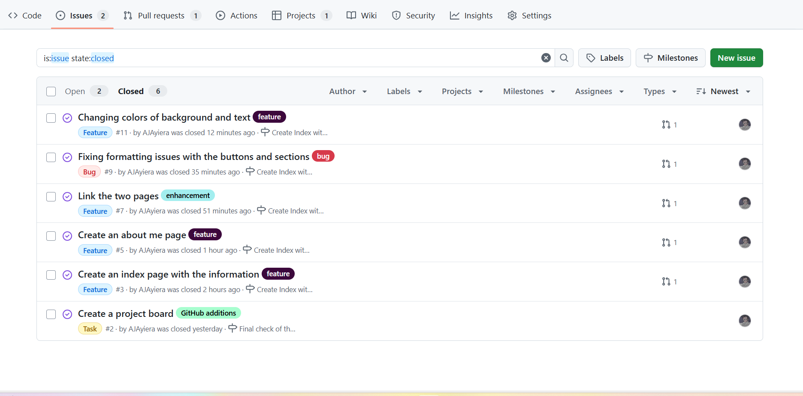

# Personal Portfolio Documentation

## 1. Student Details

- **Full Name**: Ayiera Ajani Maina
- **Admission Number**: 150658
- **GitHub Username**: @AJAyiera
- **Email**: ajani.ayiera@strathmore.edy

## 2. Deployed Portfolio Link

- **GitHub Pages URL**:  
 https://is-project-4th-year.github.io/build-your-portfolio-github-workflow-essentials-AJAyiera/index.html

## 3. Learnings from the Git Crash Program

**🧠 What I Thought I'd Learn vs What I Actually Learned**
**1. Concept: Branching**

`Expectation 👀` : I never thought branching was important and everything could be done on the main brand.

`Reality 😅`: Branching is the most important feature in team development

`Impact 💡`: I learnt to work with branches to avoid interfering with my teammates work and to document changes

**2. Concept: Merging**

`Expectation 👀` : I never needed to merge since I was always on the main branch.

`Reality 😅`: Merging allows for updating the main branch with only the wanted changes that are ready to be integrated.

`Impact 💡`: I can now display what is only necessary and ready for the project.

**3. Concept: Issue and Milestones**

`Expectation 👀` : I thought these features would not be useful for solo developers.

`Reality 😅`: They help track changes and branches allowing for progress tracking over time.

`Impact 💡`: I can structure my work and time better with clear goals for each step of the way.

**4. Concept: Documentation**

`Expectation 👀` : I would havve learnt how to use md. files.

`Reality 😅`: Documentation has a lot of important instructions for the potential users and clients.

`Impact 💡`: I can now create detailed documentation pages for my projects on GitHub.

**5. Concept: Deploying Pages**

`Expectation 👀` : I did not know this was possible.

`Reality 😅`: GitHub can simulate pages that I create, providing a way to preview and launch sites.

`Impact 💡`: I can now deploy pages when ready through the repository settings.

## 4. Screenshots of Key GitHub Features

Include screenshots that demonstrate how you used GitHub to manage your project. For each screenshot, write a short caption explaining what it shows.

> Upload the screenshots to your GitHub repository and reference them here using Markdown image syntax:
> (you could just simply copy and paste the image into the Assignment.md)

```markdown

```

### A. Milestones and Issues



### B. Project Board


### C. Branching

- Screenshot showing your branch list with meaningful naming.

### D. Pull Requests

- Screenshot of a pull request that’s either open or merged and linked to a related issue.

### E. Merge Conflict Resolution

- Screenshot of a resolved merge conflict (in a pull request, commit history, or your local terminal/GitHub Desktop).
